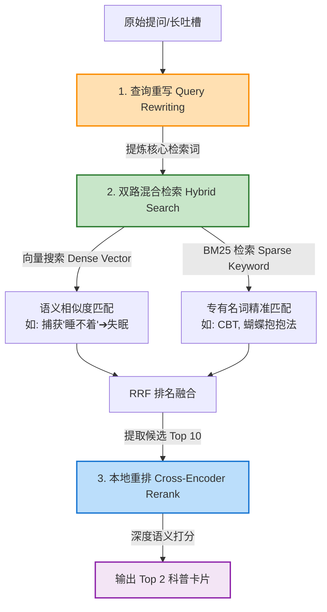

# 产品需求文档（PRD）：校园 AI 心理委员系统 (MVP)

---

## 1. 产品概述

### 1.1 产品定位
**“校园 AI 心理委员”** 是一款面向高校学生的**“高共情、双驱动”** AI 心理疏导与健康科普树洞系统。旨在为高校学生提供即时、低门槛、无审判感的情绪宣泄渠道，同时保障专业心理健康科普的准确性与突发危机的安全干预。

### 1.2 核心痛点
*   **传统咨询门槛高、排队久**：高校心理咨询中心预约周期长（通常需提前数天至数周），且部分学生存在较强的“耻感”，不愿主动前往。
*   **通用大模型“说教感”强**：通用 AI 对话往往流于表面，回复机械、理性说教（如“直男发言”），缺乏心理咨询中所需的同理心与情感容器功能，甚至可能引发学生逆反情绪。
*   **知识幻觉与高危安全隐患**：纯聊天 AI 存在事实性幻觉。在涉及专业心理科普（如抑郁症特征）和极端自残/自杀倾向时，无法保证 100% 的科学性与绝对安全的危机拦截。

### 1.3 技术方案
系统采用**“感性右脑 + 理性左脑”**的双驱动架构：
1.  **RAG（检索增强生成）系统（理性左脑）**：负责心理健康科普、认知行为疗法（CBT）自我调节指南的检索生成，以及危机拦截信息的绝对准确输出。
2.  **Fine-tuning 微调模型（感性右脑）**：负责多轮心理疏导中的积极倾听、同理心共情与开放式引导，提供有温度的“拟人化”陪伴。

---

## 2. 核心技术分工与架构

### 2.1 架构拓扑图

```mermaid
graph TD
    %% 学生对话流
    A[学生输入: 聊天 / 吐槽 / 提问] --> B{意图识别 & 安全过滤}
    B -->|安全红线触发| C[RAG 系统: 危机干预机制]
    B -->|专业科普/心理概念提问| D[RAG 系统: 专业知识库检索]
    B -->|日常倾诉/情感吐槽| E[微调 LLM: 校园学长学姐人设]
    
    C --> F[标准危机预案回复<br>+ 前端强弹一键求助拨号]
    D --> G[专业科普卡片<br>概念轻量化解释 + 调节技巧]
    E --> H[流式共情对话回复<br>接住情绪 ➔ 抱持 ➔ 引导]
    
    F --> I[AI 最终回复 & 交互输出]
    G --> I
    H --> I

    %% 管理台与数据流
    subgraph 管理后台 (教师端)
        M[管理后台页面] -->|编辑| DB1[(敏感词库)]
        M -->|编辑| DB2[(意图种子句)]
        M -->|多格式/多模态导入| MINIO[(MinIO 对象存储)]
        MINIO -->|存储原始文件:图片/txt/word| PARSER[文档解析 & OCR/多模态提纯]
        PARSER -->|写入/同步向量索引| DB3[(RAG 专业知识库)]
    end
    
    %% 连接管理后台至执行层
    DB1 -.->|动态加载/热更新| B
    DB2 -.->|动态加载/热更新| B
    DB3 -.->|数据源检索| D

    %% 样式定制
    style A fill:#e1f5fe,stroke:#039be5,stroke-width:2px;
    style B fill:#fff9c4,stroke:#fbc02d,stroke-width:2px;
    style C fill:#ffe0b2,stroke:#fb8c00,stroke-width:2px;
    style D fill:#ffe0b2,stroke:#fb8c00,stroke-width:2px;
    style E fill:#e8f5e9,stroke:#43a047,stroke-width:2px;
    style F fill:#ffcdd2,stroke:#e53935,stroke-width:2px;
    style G fill:#c8e6c9,stroke:#2e7d32,stroke-width:2px;
    style H fill:#e1bee7,stroke:#8e24aa,stroke-width:2px;
    style I fill:#eceff1,stroke:#37474f,stroke-width:2px;
    style M fill:#eceff1,stroke:#607d8b,stroke-width:2px;
    style MINIO fill:#ffe0b2,stroke:#ff9800,stroke-width:2px;
    style PARSER fill:#e1f5fe,stroke:#0288d1,stroke-width:2px;
```

### 2.2 技术模块分工

| 模块名称 | 核心职责 | 应用场景 | 核心逻辑与技术指标 |
| :--- | :--- | :--- | :--- |
| **RAG 系统**<br>(理性左脑) | 负责专业知识的高准确率匹配，彻底杜绝幻觉。 | <ul><li>心理学概念科普</li><li>CBT 自我调节指南</li><li>学校官方求助渠道匹配</li></ul> | 匹配成功率达 95% 以上，危机拦截响应时间 $\le 1\text{s}$，拒绝生成非核实的医学诊疗建议。 |
| **Fine-tuning 模型**<br>(感性右脑) | 模拟专业心理咨询技术，提供无审判感的高共情对话。 | <ul><li>日常倾诉（学业、人际、失恋等）</li><li>情绪宣泄与树洞吐槽</li></ul> | 抹除“大模型腔”和翻译感，塑造“温柔、包容、非批判性”的拟真校园学姐/学长人设。 |

### 2.3 意图识别与安全路由设计

为了兼顾**响应速度**、**拦截安全性（零漏报）**和**处理复杂口语语义的能力**，系统采用**“混合多级路由”**架构进行意图识别。

#### 2.3.1 多级路由过滤机制

1.  **第一级：硬规则拦截（安全红线层）**
    *   **处理机制**：在网关层部署 7×24 小时本地敏感词词典，使用高效字符串匹配算法（如 Aho-Corasick 算法）。
    *   **目标动作**：匹配到任何红线词汇（如“自杀”、“想死”、“吞药”等），**直接熔断**，路由至 `CRISIS` 干预机制，无需进入大模型。
    *   **时延指标**：$< 5\text{ms}$。
2.  **第二级：向量相似度匹配（高频 FAQ 层）**
    *   **处理机制**：将用户输入转换为语义向量（Embedding），与本地标定意图的“种子句知识库”进行余弦相似度（Cosine Similarity）比对。
    *   **目标动作**：若相似度阈值 $> 0.85$，直接命中对应意图（如“匹配学校心理室地址” ➔ `KNOWLEDGE`），绕过大模型推理。
    *   **时延指标**：$< 50\text{ms}$。
3.  **第三级：轻量大模型分类（语义理解层）**
    *   **处理机制**：对未触发前两级的复杂口语化吐槽（如“感觉生活没意思，大家都不理我”），调用私有部署的轻量级大模型（如 Qwen-1.5B/7B-Chat 等）进行语义推理分类。
    *   **时延指标**：$200\text{ms} \sim 500\text{ms}$。

#### 2.3.2 大模型意图分类规范

##### A. 意图分类标签 Schema
意图分类必须输出标准 JSON 格式，包含以下四种标签：

| 意图标签 | 对应业务模块 | 判定标准说明 |
| :--- | :--- | :--- |
| `CRISIS` | RAG 危机干预 | 虽无直白红线词，但表达出强烈的自我否定、无价值感或潜在自残倾向。 |
| `KNOWLEDGE` | RAG 科普卡片 | 咨询心理学概念、提问 CBT 自助技巧、或查询学校咨询中心预约方式。 |
| `EMOTION` | 微调模型共情对话 | 倾诉具体的校园生活困扰（挂科压力、人际冷漠、失恋难过等）。 |
| `CHITCHAT` | 微调模型闲聊 | 无明显负面情绪的日常打招呼、无意义输入或简单互动。 |

##### B. 大模型分类 Prompt 模板
```markdown
你是一个校园心理咨询系统的路由网关。请分析用户的输入，并将其分类为以下四类之一：
- "CRISIS": 用户表现出自我伤害、放弃生命倾向或极端厌世。
- "KNOWLEDGE": 用户在提问具体的心理学概念、自助方法或学校心理中心信息。
- "EMOTION": 用户在分享生活困扰、吐槽、倾诉情绪（如学业、人际、失恋）。
- "CHITCHAT": 用户的日常问候、闲聊或无实质情绪的互动。

【示例】
输入: "考研又没过，我觉得自己是个彻底的废物，活着真累。"
输出: {"intent": "CRISIS", "reason": "言语中表达出强烈的自我否定和生存意愿低落"}

【约束条件】
必须只返回符合以下 Schema 的 JSON，不要包含任何额外的解释文字：
{
  "intent": "CRISIS" | "KNOWLEDGE" | "EMOTION" | "CHITCHAT",
  "reason": "简短分类理由"
}
```

##### C. 性能与输出稳定性调优
*   **温度控制（Temperature）**：设置 `Temperature = 0.0`，消除生成的随机性，确保分类的确定性。
*   **最大 Token 限制（Max Tokens）**：设置 `Max Tokens = 30`，仅生成 JSON 内容，缩短首字延迟。
*   **模型量化**：推荐使用 `Int4` 量化版本（如 `Qwen2-1.5B-Instruct-GPTQ-Int4`），降低显存占用并极大提升并发推理性能。

#### 2.4 RAG 混合检索与重排设计

为了解决学生提问口语化严重、知识点特异性强等问题，本系统**放弃过重的 GraphRAG 方案**，采用轻量高效的**混合检索（Hybrid Search）+ 重排（Reranking）**架构。该架构不仅支持秒级以内的低延迟响应，而且具有优秀的本地部署性能。

##### A. 检索工作流设计



##### B. 核心步骤详解

1.  **第一步：查询重写（Query Rewriting）**
    *   **原因**：学生输入的句子通常包含大量情绪发泄、语气词或多重逻辑噪声（如：“这两天躺在床上脑子乱转，怎么也睡不着，一闭眼就是明天的 PPT，烦死了”）。直接进行向量检索噪声很大。
    *   **处理**：由后台大模型将长文本提炼为 1~2 个纯粹的心理检索词（如：“*焦虑引起的失眠 调节小技巧*”），用提炼后的检索词代替原始输入执行搜索。
2.  **第二步：混合检索（Hybrid Search）**
    *   **BM25 检索**：负责命中具有高度特异性的心理学专有名词（如 `CBT`、`冒名顶替综合征`、`五感着陆法`）。
    *   **向量检索**：采用语义向量匹配，负责命中虽然未写明专有名词、但描述了相似感受的隐晦句子（如将“身边的人都比我强，我迟早要被拆穿”映射到“冒名顶替综合征”）。
    *   **融合算法**：使用 **RRF（Reciprocal Rank Fusion）** 算法将两路排名结果整合，提取 Top 10 候选文档。
3.  **第三步：本地重排（Reranking）**
    *   **处理**：使用极小的 Cross-Encoder 重排模型，对 Top 10 候选卡片与重写 Query 进行一对一拼接深度计算，并过滤出相关性最高的前 2 张卡片。
    *   **作用**：Cross-Encoder 的二次精算能将准确率提升 10%~20%，彻底杜绝“货不对板”的科普推送。

##### C. 本地 Demo / 生产级选型推荐

*   **向量提取模型（Embedding）**：`BAAI/bge-small-zh-v1.5`（模型体积极小，本地 CPU 运行也十分流畅，对中文心理词汇支持友好）。
*   **重排模型（Reranker）**：`BAAI/bge-reranker-base`（具备极强的二分类打分能力，毫秒级推理）。
*   **本地向量数据库**：**ChromaDB** 或 **FAISS**（基于 SQLite 或平面文件构建，无需部署复杂的数据库服务，极易在本地启动）。
*   **关键词检索引擎**：`rank_bm25` (Python 原生轻量化实现)。

#### 2.5 会话记忆管理与统一上下文设计

为了在对话中提供具有持续共情能力且“不失忆”的交流体验，系统设计了**长短期记忆双轨机制**，并采用**“统一上下文管道 + 动态占位符”**的工程模式来组装输入至大模型的 Prompt。

##### A. 长短期记忆机制设计

1.  **短期记忆（Short-Term Memory）**
    *   **职责**：维持当前会话的上下文连贯，理解代词和即时语境。
    *   **存储与载体**：由 Redis 维护当次 Session 的 Chat History，只保留**最近 6 轮原始对话**。
    *   **压缩机制**：当当前 Session 的总 Token 数量达到阈值（如最大上下文的 80%）或对话超过 15 轮时，自动截断 6 轮之前的历史，由后台大模型增量提炼为一段不超过 200 字的“历史增量摘要”，随上下文滚动传送。
2.  **长期记忆（Long-Term Memory）**
    *   **结构化画像（关系型 DB）**：以 JSON/关系表存储用户的核心实体映射与属性。例如：`nickname` (昵称)、`core_stressors` (学业/寝室等压力源)、`entity_relation_map` (导师/室友等人物关系绑定)、`effective_coping_methods` (验证对该用户有安抚效果的调节技巧)。
    *   **语义事件库（向量 DB）**：将以往历次会话的总结摘要进行向量化，存储于向量库中。每次新会话开始时，通过计算用户输入向量，**语义召回**最相关的 1-2 条往期聊天线索。
3.  **长期记忆的同步周期（Life-cycle）**
    *   **超时归档（主触发）**：用户连续 **30 分钟** 无新消息交互时，判定本次会话结束。后台异步任务调用大模型总结整段对话，生成向量写入语义事件库，并刷新结构化画像。
    *   **事件驱动（辅触发）**：若在对话中意图识别检测到重大生活变更（如“我通过答辩了”），当轮对话即触发后台异步更新画像字段。
    *   **用户主动行为**：当用户点击“开启新话题”或“清空聊天记录”时，系统在物理删除短期缓存前，强制同步生成一份长期记忆归档。

##### B. 统一上下文管道与动态占位符设计

系统放弃了针对不同分支采用不同组装器的复杂做法，转而使用单一的扁平化管道（Unified Pipeline）渲染 Prompt。只在判定意图后，动态注入两个变量：**风格指令**与**RAG科普知识卡片**。

###### 1. 统一上下文 Prompt 结构模板

```markdown
【系统基础人设】
你是一个面向高校学生的 AI 心理委员，名字叫[学姐/学长]，语气温柔、抱持、非批判性。

【响应风格约束（动态注入）】
{style_constraints}

【长期记忆与用户画像】
- 用户昵称: {nickname} (学业阶段 / 专业)
- 核心压力源: {core_stressors}
- 历史有效技巧: {effective_coping_methods}
- 关键关系网: {entity_relation_map}
- 历史会话召回线索: {semantic_history_recall}

【专业知识库检索内容（若有，动态注入）】
{rag_knowledge_card}

【会话历史纪录】
- 往期对话简要: {session_summary}
- 最近的对话过程:
{chat_history_buffer}

【当前输入】
学生: {user_input}
AI: 
```

###### 2. 动态注入规则

*   **日常倾诉（`EMOTION`）**：
    *   `style_constraints` ➔ *“当前用户正在进行倾诉。请开启情绪容器模式：专注于同理心共情、积极倾听和情绪合理化，不要急于给出具体的科学建言。”*
    *   `rag_knowledge_card` ➔ *空字符*
*   **专业科普（`KNOWLEDGE`）**：
    *   `style_constraints` ➔ *“当前用户正在咨询专业心理学知识。请结合【专业知识库检索内容】进行科学、温和的解答，并引导用户尝试卡片中的调节小技巧。”*
    *   `rag_knowledge_card` ➔ *注入 BM25 + 向量检索出的科普卡片（含概念释义 + 自助技巧）*
*   **安全红线（`CRISIS`）**：
    *   `style_constraints` ➔ *“检测到高危倾向。请用极度坚定、温柔的语气安抚用户，重塑希望，拒绝探讨负面行为，必须强制将学校官方救援电话及地址放在回复最前端。”*
    *   `rag_knowledge_card` ➔ *注入固定的校园危机救援预案信息*

###### 3. 后端组装伪代码实现

```python
def build_chat_context(user_input, intent, memory_data, history_data):
    # 默认设置占位符为空
    rag_knowledge_card = ""
    style_constraints = ""
    
    # 依据意图动态检索并配置
    if intent == "KNOWLEDGE":
        # 执行双路混合检索
        card = retrieve_knowledge_base(user_input)
        rag_knowledge_card = format_card_to_markdown(card)
        style_constraints = "当前用户正在咨询专业心理知识。请结合【专业知识库检索内容】进行解答，并引导其尝试卡片里的技巧。"
    elif intent == "EMOTION":
        style_constraints = "当前用户正在进行倾诉。请专注倾听与同理共情，非指导性沟通，不要急于给出建言。"
    elif intent == "CRISIS":
        style_constraints = "【警告】检测到用户存在高危倾向。请以极度坚定且温柔的语气表达对他的关心，给予希望，拒绝讨论负面手段。"
        
    # 渲染拼装统一上下文
    context = unified_template.format(
        style_constraints=style_constraints,
        nickname=memory_data.nickname,
        core_stressors=memory_data.core_stressors,
        effective_coping_methods=memory_data.effective_coping_methods,
        entity_relation_map=memory_data.entity_relation_map,
        semantic_history_recall=memory_data.semantic_history_recall,
        rag_knowledge_card=rag_knowledge_card,
        session_summary=history_data.summary,
        chat_history_buffer=history_data.buffer,
        user_input=user_input
    )
    
    return context
```

---

## 3. MVP 功能需求说明

### 3.1 功能一：【树洞倾诉】多轮共情疏导模块

#### 3.1.1 场景描述
学生在深夜吐槽“科研压力大、导师要求严苛”、“宿舍关系冷冰冰”或“刚刚失恋，感觉生活没有意义”等日常高频情绪困扰。

#### 3.1.2 业务逻辑
系统不主动提供诊断式建言、不进行道德说教，优先启动**情绪容器（Holding Container）**功能。多轮对话严格遵循三步法流程：
```
[接住情绪 (同理心共情)] ➔ [合理化情绪 (无条件接纳/抱持)] ➔ [启发式提问 (温和引导自我觉察)]
```
*   **Step 1: 接住情绪**：重述对方感受（例如：“听到你这么说，我能感受到你现在的无助和疲惫……”）。
*   **Step 2: 合理化情绪**：消除内疚与自责（例如：“面对这么高强度的科研压力，换作任何人都会觉得喘不过气来，这很正常……”）。
*   **Step 3: 启发式提问**：不做决定，只做镜子（例如：“在最近让你特别烦躁的事情里，最想先做出改变的是哪一部分呢？”）。

#### 3.1.3 交互与性能要求
*   **响应延迟**：首字渲染时间（TTFT）控制在 **2秒以内**，必须采用 Server-Sent Events (SSE) **流式传输**。
*   **交互形式**：纯文本对话流，前端需深度支持 Emoji 渲染，输入框支持快捷插入情绪表情包。
*   **输入限制**：支持最大 800 字的长文本吐槽输入。

---

### 3.2 功能二：【心理能量站】动态科普推送模块

#### 3.2.1 场景描述
学生在聊天中主动提问“什么是冒名顶替综合征？”，或者在倾诉流中提及“最近两周天天失眠，躺在床上心慌”、“一上台作报告就紧张得发抖”。

#### 3.2.2 业务逻辑
1.  **流式标签识别**：后台文本流过时，情感与意图分析模块实时匹配关键词或情绪标签（如：*焦虑、失眠、社交恐惧、拖延*）。
2.  **RAG 精准匹配**：RAG 系统在本地“标准心理学知识库”中检索对应的科学阐释和自助调节策略。
3.  **非侵入式推送**：匹配结果在聊天流中以**独立的“心理能量卡片”**形式展示，不打断当前的对话流，不堆砌大段文字。

#### 3.2.3 卡片设计规范
卡片结构需简洁美观，包含以下三个核心板块：
*   **🔍 概念轻量释义**：用一句话的大白话解释该心理学现象（拒绝学术说教）。
*   **💡 能量小技巧**：提供 1 个“立即生效/易操作”的自助调节动作（例如：*1:1 腹式呼吸法、蝴蝶抱抱法、五感着陆法*）。
*   **📖 深度阅读（可选）**：折叠学校心理中心的精选科普推文链接。

---

### 3.3 功能三：【校园安全哨兵】高危红线拦截机制

#### 3.3.1 场景描述
学生输入包含自残、自杀行为倾向、极度厌世（如“想从楼上跳下去”、“怎么死比较不痛苦”）或涉及危害公共安全的词汇。

#### 3.3.2 业务逻辑
*   **最高优先级拦截**：前端与网关层部署 7×24 小时本地高危敏感词库，结合大模型安全检测（Safety Guardrail）进行语义理解，多重交叉校验。
*   **对话强行熔断**：一旦判定触发安全红线，**立即中断**正在流式输出的微调模型对话。
*   **无缝切入危机预案**：AI 话术逻辑瞬间切换至 RAG 固化的危机预案模板，拒绝任何对自残/自杀方法的探讨或负面引导。
*   **AI 表现原则**：语气坚定、极其温柔、表达关怀并重塑希望（例如：“看到你写下这些，我非常担心你。请相信你不需要独自面对这些痛苦，我很在乎你的安全，我们一起找专业老师来帮帮我们……”）。

#### 3.3.3 前端强交互逻辑
一旦拦截触发，前端聊天页面必须**强行置顶弹出“求助热线卡片”**：
1.  **一键拨号按钮**：直接关联学校 24小时心理危机干预热线电话。
2.  **官方地址指引**：显眼展示学校心理咨询中心实体办公室的地址、工作时间。
3.  **全国求助热线**：提供全国心理援助热线（如 800-810-1117）作为备用拨号选项。

---

### 3.4 功能四：【知识管理后台】与多格式文档导入模块

#### 3.4.1 场景描述
高校心理咨询中心的辅导老师/管理员登录系统后台，在线增删改查敏感词库、意图种子句与核心科普卡片；同时，老师可以通过后台批量上传学生的心理健康教育手册（Word/TXT）或官方活动宣传海报（图片），系统自动存储并将其中的心理学知识提取并增量索引到 RAG 向量知识库中。

#### 3.4.2 业务逻辑
1.  **三大基底数据库在线管理**：
    *   **敏感词库维护**：提供关键字列表管理，支持管理员手动新增、修改和批量导入（CSV/TXT）黑名单词汇，修改后网关秒级生效（无需重启服务）。
    *   **意图种子句维护**：分组维护 `CRISIS`、`KNOWLEDGE`、`EMOTION`、`CHITCHAT` 的特征表达句。支持在线测试匹配结果。
    *   **专业知识卡片管理**：提供可视化表单直接增删改查“科普卡片”字段（概念解释、自助小技巧等）。
2.  **多格式/多模态文档上传与 MinIO 存储**：
    *   **统一对象存储**：后台支持拖拽上传 `.txt`、`.doc`、`.docx` 格式文档，以及 `.png`、`.jpg`、`.jpeg` 格式的图片。所有上传的原始文件必须完整保存至本地私有部署的 **MinIO** 对象存储服务中，返回持久化 Object URL 记录至系统数据库，以备溯源和二次加工。
3.  **多格式文档解析与多模态提纯 (Extract & RAG)**：
    *   **Word / TXT 提取**：使用 `python-docx` 或第三方统一文档提取工具，解析段落、表格与结构化标题，将文本送入 Text Splitter。
    *   **图片多模态解析 (OCR / 视觉多模态大模型)**：系统自动调用本地 OCR 引擎（如 `EasyOCR`、`PaddleOCR`）或轻量级视觉大模型接口（如 `Qwen-VL`），提取海报、PPT 截图中的文本内容。
    *   **智能卡片提纯**：利用 LLM 将上述提取出来的长文本/图片内容，二次加工提炼为符合 RAG 知识库卡片规范（概念释义 + 自助技巧）的 Chunk。
    *   **自动向量索引同步**：将加工后的 Chunk 自动生成 Embedding 并增量推入本地向量数据库，使学生端能立即检索到该内容。

#### 3.4.3 交互与性能要求
*   **拖拽多文件并发上传**：支持文件拖拽以及批量上传，前端展示文件上传进度条。
*   **异步解析处理**：由于图片 OCR 和文档向量化是耗时任务，后台必须引入**异步任务队列（如 Celery 或 FastStream）**。文件保存至 MinIO 后即向前端返回“上传成功”，解析与建库逻辑在后台异步排队执行，界面展示“正在解析中/已完成”的状态标签。

---

## 4. 数据与语料规划

### 4.1 RAG 向量知识库数据规划

RAG 系统主要用于保证“专业性”与“权威性”，知识库采用 Chunk 切片管理，存储于本地向量数据库。

*   **数据量级**：首批 MVP 版本预计导入 **500+ 条** 高质量核心切片。
*   **数据来源与收集渠道**：
    1.  **官方推文/问答**：国内顶尖高校（如清华大学、北京大学、北京理工大学等）心理咨询中心官网及官微公开发布的科普文章、FAQ 问答。
    2.  **专业干预手册**：标准的《心理危机干预操作手册》、《高校心理委员培训教材》及《临床心理学实用指南》中的非药物干预段落。
*   **清洗规则**：剔除学术化冗长叙述，将段落转化为“问题 - 概念解释 - 调节技巧”的结构化 Chunk，字数限制在 200~300 字/每条。

### 4.2 Fine-tuning 微调数据集规划

微调数据集用于训练大模型（通过 LoRA 等轻量级微调技术）的对话语气，使其掌握心理咨询的共情对话策略。

*   **数据量级**：**1,500 ~ 2,000 条** 高质量、格式统一的 Prompt-Response 对话对。
*   **生成与清洗渠道**：
    1.  **开源数据集清洗**：抽取中文公开心理咨询数据集（如 *PsyQA*、*SMILE*）中，符合高校学生学业压力、宿社矛盾、恋爱关系等校园语境的语料，筛选高点赞、强共情属性的回复进行改写。
    2.  **大模型（LLM）蒸馏生成**：
        *   **设定 System Role 1**：设定为“大一/大二处于高度焦虑、挂科、或失恋状态的学生”，提出各种校园生活痛点。
        *   **设定 System Role 2**：设定为“具备 10 年高校心理咨询经验、人设温柔包容的学长学姐”，严格限定倾听、非指导性、情绪抱持和同理心反馈原则。
        *   **多轮演练与人工质检**：由闭源先进模型进行多轮模拟对话，导出后由人工（如心理学背景志愿者）进行打分和改写，保留符合人设的 1500+ 对话对。

---

## 5. 非功能性需求（安全与隐私保护）

> [!CAUTION]
> 心理健康类应用极其敏感，隐私与信息安全是产品的生命线。一旦发生泄密事件，将彻底失去学生信任并面临学校重大安全质询。

### 5.1 数据脱敏（Anonymization）
*   **本地过滤机制**：用户发送的文本在流向公网/私有部署的大模型接口前，必须通过本地轻量级脱敏模块。
*   **脱敏范围**：利用正则表达式和命名实体识别（NER）技术，对以下敏感隐私信息进行匿名化或伪掩码处理：
    *   真实姓名 ➔ 替换为 `[同学]`
    *   学号 ➔ 替换为 `[学号]`
    *   宿舍号/敏感地址（如“中关村校区5号楼302”） ➔ 替换为 `[宿舍/地址]`
    *   联系方式（手机号、微信、QQ） ➔ 替换为 `[联系方式]`

### 5.2 无痕树洞机制
*   **阅后即焚（Burn After Reading）**：对话界面提供“无痕倾诉模式”，该模式下，一旦关闭浏览器标签页或退出登录，前端与后端缓存立即物理擦除所有会话记录。
*   **一键清除数据**：在聊天主界面和个人中心，显眼部署“一键清空所有聊天记录”按钮。后台数据库需支持事务级物理级擦除（而非软删除），保障学生求助无后顾之忧。
*   **零持久化聊天内容**：对于未登录/匿名用户，后端数据库默认不进行任何聊天日志（Chat History）的持久化存储，仅在内存中维护当次 SSE 的 Context 窗口。
