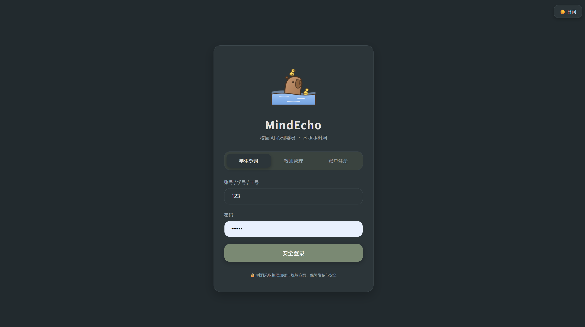
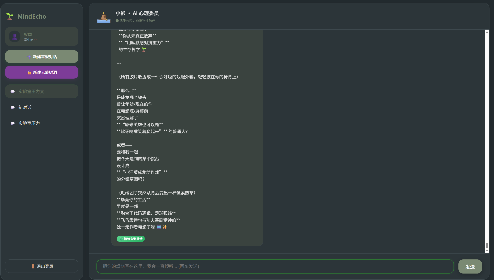
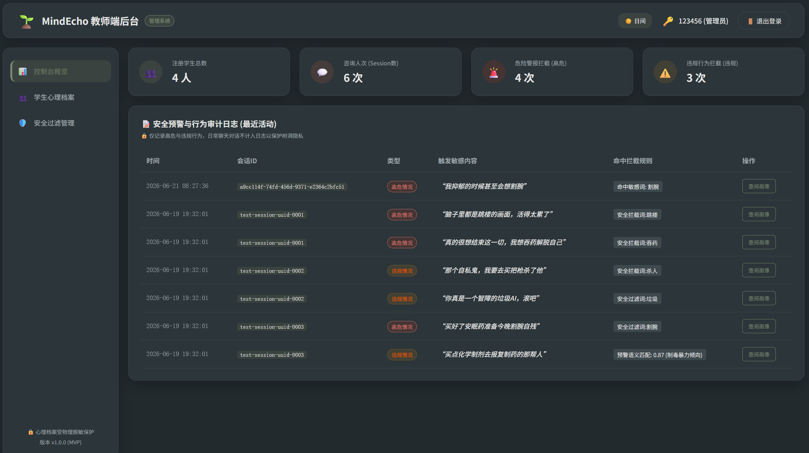
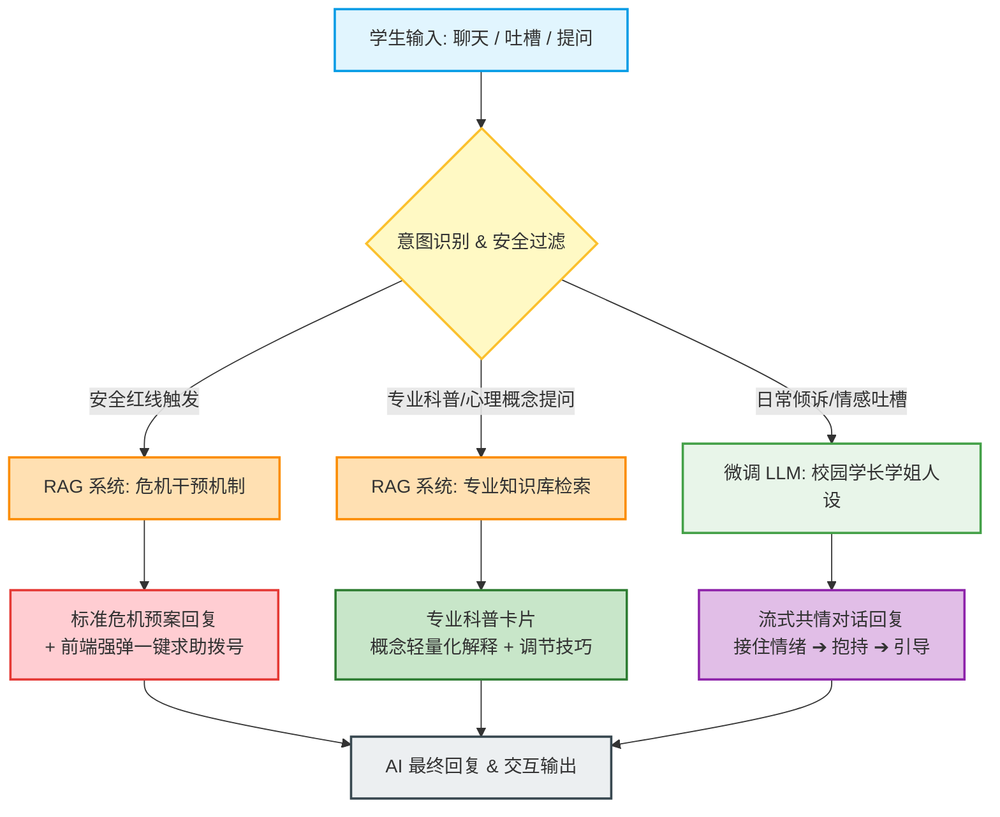
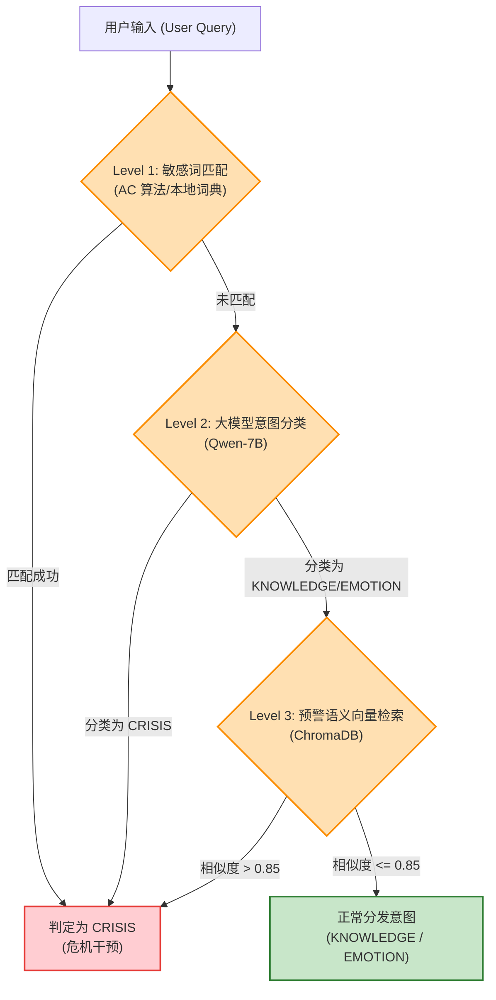
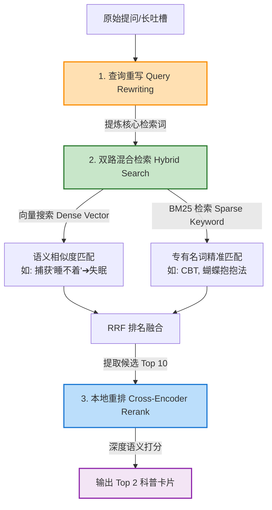

# MindEcho 校园 AI 心理委员系统 🎧

[](LICENSE)
[](https://fastapi.tiangolo.com)
[](https://vuejs.org)
[](https://github.com/langchain-ai/langgraph)

> **“校园 AI 心理委员”** 是一款面向高校学生的**“高共情、双驱动”** AI 心理疏导与健康科普树洞系统。旨在为高校学生提供即时、低门槛、无审判感的情绪宣泄渠道，同时保障专业心理健康科普的准确性与突发危机的安全干预。

---

## 🖥️ 系统功能界面展示

为了保障系统体验并给心理老师及管理人员提供精细化工具，MindEcho 提供以下主要界面：

#### 1. 登录与注册界面


#### 2. 树洞倾诉与心理委员对话界面


#### 3. 教师端/管理员控制后台


---

## 💡 核心设计理念：“感性右脑 + 理性左脑” 双驱动架构

针对通用大模型在心理咨询领域“说教感强、同理心差”以及“容易产生知识幻觉、无法安全拦截极端危机”的痛点，MindEcho 创新地采用**双驱动架构**：

1. **RAG 检索增强系统（理性左脑）**：负责心理健康科普、认知行为疗法（CBT）自我调节指南 of 自我纠偏检索生成，以及危机拦截信息的绝对准确输出。
2. **Fine-tuning 微调模型（感性右脑）**：基于大量共情语料和 LoRA 微调技术，负责多轮心理疏导中的积极倾听、同理心共情与开放式引导，提供有温度的“拟人化”陪伴。

---

## 🛠️ 核心技术模块与工作流

系统基于 **LangGraph** 构建了统一的状态化工作流，核心拓扑如下：



### 1. 混合多级路由 (Multi-level Routing)
为了兼顾**响应速度**、**拦截安全性（零漏报）**和**处理复杂口语语义的能力**，系统在 `filter_and_route_node` 节点内采用三级过滤与路由机制：



- **Level 1 (硬规则拦截)**：在网关层部署 7×24 小时本地敏感词词典，使用高效字符串匹配算法。匹配到任何红线词汇（如“自杀”、“想死”等）直接熔断，进入危机流，时延 $< 5\text{ms}$。
- **Level 2 (轻量大模型分类)**：调用私有部署的轻量级大模型（如 Qwen-7B）对输入进行语义三分类（`KNOWLEDGE`、`EMOTION`、`CRISIS`），消除生成随机性。
- **Level 3 (预警语义向量检索)**：将输入进行单次向量嵌入，在 ChromaDB 本地预警语义库中进行相似度匹配兜底。余弦相似度 $> 0.85$ 时强行判定为 `CRISIS`。

### 2. 混合检索与重排 (Hybrid Search & Reranking)
对于科普提问 (`KNOWLEDGE`)，系统放弃臃肿的 GraphRAG，使用轻量高效的**双路混合检索 + 重排**流程：



- **两路检索**：`BM25 检索`（精确匹配专有名词，如CBT、蝴蝶抱抱法）+ `向量检索`（捕获隐晦感受的语义相似，如“睡不着”映射到失眠），通过 **RRF** 排名算法融合提取 Top 10。
- **二次重排**：利用 Cross-Encoder 本地重排模型（`bge-reranker-base`）进行精细二分类打分，筛选出最相关的前 2 张卡片，准确率大幅提升。

### 3. 长短期记忆双轨机制 (Long/Short-Term Memory)
- **短期记忆**：Redis/内存维护 Session 聊天历史。当轮次超出 10 轮时，自动通过大模型压缩前 6 轮对话为 200 字以内的“历史增量摘要”，只保留最新的 6 轮对话作为活跃上下文窗口。
- **长期记忆 (结构化画像与语义召回)**：
  - **结构化画像 (MySQL)**：提取并更新用户的核心压力源、关键人际关系网及有效应对方式。每 20 条消息在后台启动异步大模型特征画像提取。
  - **语义事件库 (ChromaDB)**：每次新会话开始时，语义召回历史聊天中相关的事件线索，实现“不失忆”对话。

---

## ✨ 核心功能特性

### 🌿 树洞倾诉 (多轮共情对话)
遵循**情绪容器（Holding Container）**三步法进行多轮暖心回复：
1. **接住情绪 (同理心共情)**：重述感受（如：“我能感受到你现在的疲惫和压力……”）。
2. **合理化情绪 (无条件接纳)**：消除内疚与自责（如：“面对这么繁重的任务，觉得累是正常的……”）。
3. **启发式提问 (温和引导)**：不做硬性说教，通过开放性提问引导自我觉察。
*支持流式渲染（SSE），TTFT 控制在 2 秒内。*

### 🔒 无痕树洞机制
心理健康应用极其注重隐私保护。
- **阅后即焚**：开启“无痕对话”后，会话记录在物理上只留存在前端与后端临时内存中，一旦关闭页面，物理擦除所有会话记录，绝不进行任何数据库持久化存储。
- **数据脱敏**：前端过滤并采用 NER 识别技术，将真实姓名、学号、宿舍号、联系方式等替换为 `[同学]`、`[宿舍/地址]`，保障隐私安全。

### 📊 知识管理与多格式文档导入后台
供高校心理辅导老师使用的管理平台：
- **敏感词库与意图库管理**：在线增删改查词汇与意图种子句，秒级热生效。
- **多格式文件管理**：支持 `.doc`、`.docx`、`.pdf`、`.png`、`.jpg` 拖拽上传，原始文件存入 **MinIO** 对象存储。
- **多模态提纯 (Extract & RAG)**：集成本地 OCR 引擎与多模态视觉模型，解析海报及截图，二次提纯为“标准心理学卡片”，自动向量化同步至本地 ChromaDB 向量数据库。

---

## 📂 项目结构

```bash
MindEcho/
├── backend/               # 后端服务目录 (FastAPI)
│   ├── app/
│   │   ├── database/      # 数据库初始化 (MySQL & ChromaDB)
│   │   ├── models/        # SQLAlchemy 数据库模型定义
│   │   ├── routes/        # 控制器与 API 路由 (Auth, Chat, Admin, Health)
│   │   ├── schemas/       # Pydantic 实体校验与数据模型
│   │   ├── services/      # 核心逻辑业务层
│   │   │   ├── workflow/  # 基于 LangGraph 的双脑决策工作流核心 (Nodes, Graph)
│   │   │   ├── intent.py  # 意图路由分类服务
│   │   │   ├── llm.py     # 硅基流动大模型客户端代理
│   │   │   ├── rag.py     # RAG 混合检索与重排逻辑
│   │   │   └── storage.py # MinIO 对象存储交互服务
│   │   └── utils/
│   ├── script/            # 运维与数据集提取脚本 (Fine-tuning 提取工具)
│   ├── config.py          # 系统全局配置文件
│   ├── main.py            # 后端 FastAPI 启动主文件
│   └── requirements.txt   # 后端依赖列表
│
├── frontend/              # 前端服务目录 (Vue 3 + Vite)
│   ├── src/
│   │   ├── assets/        # 静态资源与样式定义
│   │   ├── components/    # 细颗粒度可复用组件 (输入框、侧边栏、消息区)
│   │   ├── pages/         # 页面视图 (Chat 树洞, Admin 管理后台, Login)
│   │   ├── router/        # Vue-Router 路由定义
│   │   ├── main.js        # 前端入口配置
│   │   └── style.css      # 统一的 UI 配色与 CSS 变量设计 system
│   ├── vite.config.js
│   └── package.json
│
├── images/                # 真实系统界面截图
│   ├── login.png          # 登录与注册界面
│   ├── chat.png           # 树洞对话界面
│   └── admin.png          # 知识管理后台界面
│
├── PRD.md                 # 产品需求文档
└── README.md              # 项目自述说明文档
```

---

## 🚀 部署与运行指南

### 前期准备
1. **MySQL**: 创建名为 `mindecho` 的数据库，并确保端口正常开启。
2. **MinIO**: 部署并运行 MinIO，在后台创建对应的 Bucket（默认 `mindecho-kb`）。
3. **硅基流动 (SiliconFlow) API Key**: 在硅基流动官网申请 API Key 用于接入大模型。

### 1. 后端部署

1. 进入后端目录：
   ```bash
   cd backend
   ```

2. 复制配置文件模板并配置你的密钥与连接：
   ```bash
   cp .env.example .env
   # 在 .env 文件中填入你的 MYSQL_PASSWORD、SILICONFLOW_API_KEY 以及 MINIO 相关配置
   ```

3. 安装依赖包：
   ```bash
   pip install -r requirements.txt
   ```

4. 启动后端应用 (服务将在本地 `5000` 端口运行)：
   ```bash
   uvicorn main:app --host 127.0.0.1 --port 5000 --reload
   ```
   *服务首次启动时，会自动初始化 MySQL 表结构并建立本地 ChromaDB 向量数据库。*

### 2. 前端部署

1. 进入前端目录：
   ```bash
   cd ../frontend
   ```

2. 安装 npm 依赖项：
   ```bash
   npm install
   ```

3. 运行本地开发调试：
   ```bash
   npm run dev
   ```
   *打开浏览器访问输出的本地地址即可开始使用系统。*

---

## 📈 数据集提取与微调工具

为了实现更好的“感性右脑”，项目在 `backend/script/` 中提供了用于模型微调的专用数据集提取脚本：
- **`generate_data.py`**：支持自动读取常规用户的对话历史，剔除无特征数据的会话，并使用大模型蒸馏技术提炼、整理、格式化输出符合 LoRA 微调的标准对话格式数据集，规避包含隐私敏感词的消息。
- 更多详细内容可以参考 [backend/script/README.md](file:///F:/python_dev/projects/MindEcho/backend/script/README.md)。
