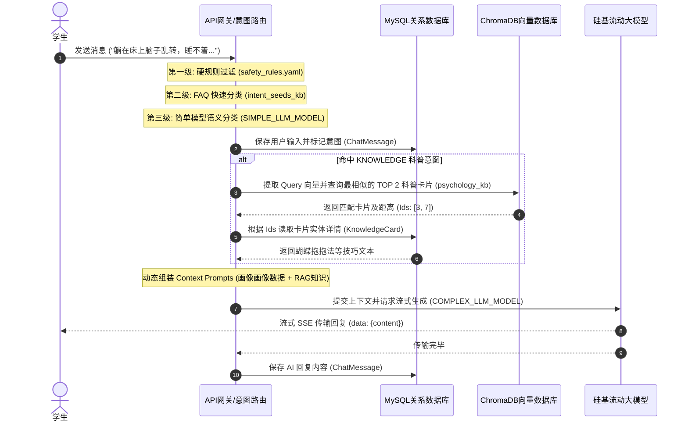

# MindEcho 系统数据模型与向量索引规约说明书

本项目采用 **双轨存储设计**，利用**关系型数据库（MySQL）**存储结构化业务实体和用户长期画像，利用**向量数据库（ChromaDB）**管理高维度语义特征和实现低延迟的语义召回，以此搭建“感性右脑 + 理性左脑”的双驱动心理健康管理平台。

---

## 一、 MySQL 关系型数据库结构规约

MySQL 主要管理系统的核心业务数据、结构化画像及聊天流水。共包含以下 4 张核心物理表。

### 1. 用户画像与基本信息表 (`users`)
*   **用途**：记录学生基本账号信息，并持久化结构化的长期心理画像（包含核心压力源、历史验证有效的疏导方法等长期记忆字段，用于动态组装 LLM 对话上下文）。
*   **结构定义**：

| 字段名称 | 数据类型 | 约束条件 | 默认值 | 描述说明 |
| :--- | :--- | :--- | :--- | :--- |
| `id` | `INT` | Primary Key, Auto Increment | - | 用户唯一自增 ID |
| `username` | `VARCHAR(80)` | Unique, Not Null, Index | - | 登录账号/学号唯一标识 |
| `nickname` | `VARCHAR(80)` | Nullable | Null | 显示昵称（如“小明同学”） |
| `created_at` | `DATETIME` | Not Null | `CURRENT_TIMESTAMP` | 账号创建时间 |
| `core_stressors` | `JSON` | Nullable | `[]` | 核心压力源（如学业、人际，以 JSON 数组形式管理） |
| `effective_coping_methods` | `JSON` | Nullable | `[]` | 历史验证有效的心理调节方法 |
| `entity_relation_map` | `JSON` | Nullable | `{}` | 重要人际关系映射（键值对，如 `{"导师": "张教授"}`） |
| `semantic_history_recall` | `TEXT` | Nullable | Null | 历次会话结束后，经大模型压缩提取的历史会话总结线索 |

---

### 2. 聊天会话主表 (`chat_sessions`)
*   **用途**：管理学生的聊天会话，支持会话标题重命名与“无痕树洞”阅后即焚标识。
*   **结构定义**：

| 字段名称 | 数据类型 | 约束条件 | 默认值 | 描述说明 |
| :--- | :--- | :--- | :--- | :--- |
| `id` | `VARCHAR(36)` | Primary Key | UUID | 会话 UUID 字符串 |
| `user_id` | `INT` | Foreign Key (`users.id`), Nullable | Null | 关联用户（匿名树洞会话此字段为空） |
| `title` | `VARCHAR(255)` | Not Null | `"新对话"` | 会话名称 |
| `created_at` | `DATETIME` | Not Null | `CURRENT_TIMESTAMP` | 会话建立时间 |
| `summary` | `TEXT` | Nullable | Null | 本次对话关闭或超时后由大模型提炼的摘要 |
| `is_anonymous` | `BOOLEAN` | Not Null | `False` | 是否为匿名无痕树洞（阅后即焚标志） |

---

### 3. 聊天消息明细表 (`chat_messages`)
*   **用途**：记录会话中发生的逐条对话记录，并保留系统的意图识别标签，方便回溯与诊断。
*   **结构定义**：

| 字段名称 | 数据类型 | 约束条件 | 默认值 | 描述说明 |
| :--- | :--- | :--- | :--- | :--- |
| `id` | `INT` | Primary Key, Auto Increment | - | 消息唯一自增 ID |
| `session_id` | `VARCHAR(36)` | Foreign Key (`chat_sessions.id`), Not Null | - | 关联的会话 ID |
| `sender` | `VARCHAR(10)` | Not Null | - | 发送人类型（`"user"`: 学生，`"ai"`: AI） |
| `content` | `TEXT` | Not Null | - | 对话消息文本正文 |
| `intent` | `VARCHAR(50)` | Nullable | Null | 系统识别的意图类型（`CRISIS`, `KNOWLEDGE`, `EMOTION`, `CHITCHAT`） |
| `created_at` | `DATETIME` | Not Null | `CURRENT_TIMESTAMP` | 消息发送时间 |

---

### 4. 心理科普知识卡片表 (`knowledge_cards`)
*   **用途**：存储专家或心理中心录入的标准科普卡片，用于与 ChromaDB 做关联查询。
*   **结构定义**：

| 字段名称 | 数据类型 | 约束条件 | 默认值 | 描述说明 |
| :--- | :--- | :--- | :--- | :--- |
| `id` | `INT` | Primary Key, Auto Increment | - | 知识卡片唯一自增 ID |
| `title` | `VARCHAR(255)` | Unique, Not Null, Index | - | 心理学概念/主题名称（如“蝴蝶抱抱法”） |
| `concept` | `TEXT` | Not Null | - | 用大白话解释的心理学概念（概念轻量释义） |
| `tip` | `TEXT` | Not Null | - | 立即生效、易于操练的心理稳定化调节技巧 |
| `tags` | `VARCHAR(255)` | Nullable | Null | 关联标签，以逗号分隔（如“焦虑,惊恐,稳定”） |
| `created_at` | `DATETIME` | Not Null | `CURRENT_TIMESTAMP` | 卡片创建时间 |

---

## 二、 ChromaDB 向量数据库集合规约

向量数据库存储文本特征向量（Embedding），当前模型参数为 1024 维（对应 `BAAI/bge-large-zh-v1.5`）。ChromaDB 包含三个主要的向量集合（Collections）。

### 1. 心理学科普知识库集合 (`psychology_kb`)
*   **核心用途**：存放用于 RAG（检索增强生成）的专业心理概念与自我稳定化技巧。
*   **物理 ID 规范**：使用 MySQL 中 `knowledge_cards.id` 的字符串作为 ID（若未落库，则使用 card 的 `title`），保证两库一致。
*   **文本块 (Documents) 拼接模版**：
    ```text
    【主题】: {title}
    【概念释义】: {concept}
    【自助技巧】: {tip}
    【标签】: {tags}
    ```
*   **元数据 (Metadata) 字典结构**：
    ```json
    {
      "title": "知识卡片标题",
      "tags": "标签1,标签2"
    }
    ```

### 2. 意图种子句高频 FAQ 集合 (`intent_seeds_kb`) *(规划中)*
*   **核心用途**：提供第二级向量路由拦截（FAQ 高频快速匹配），当用户输入与种子句余弦相似度 $> 0.85$ 时，跳过大模型推理直达业务层。
*   **物理 ID 规范**：以种子句 MD5 散列值 or 自增字符串作为 ID。
*   **文本块 (Documents)**：高频意图种子句（例如：“预约心理咨询中心在哪”、“如何判断自己是不是得了抑郁症”）。
*   **元数据 (Metadata) 字典结构**：
    ```json
    {
      "intent": "KNOWLEDGE",
      "text": "高频种子句原始文本"
    }
    ```

### 3. 会话历史语义事件集合 (`semantic_history_kb`) *(规划中)*
*   **核心用途**：属于用户长期画像的辅助层。在用户退出或超时归档时，将单次会话摘要向量化存入，并在后续新对话启动时语义召回“前情提要”。
*   **物理 ID 规范**：以 `session_id` 作为 ID。
*   **文本块 (Documents)**：会话摘要总结文本。
*   **元数据 (Metadata) 字典结构**：
    ```json
    {
      "user_id": 12345,
      "session_id": "session-uuid-xxxx-xxxx"
    }
    ```

---

## 三、 数据流动与同步示意图


