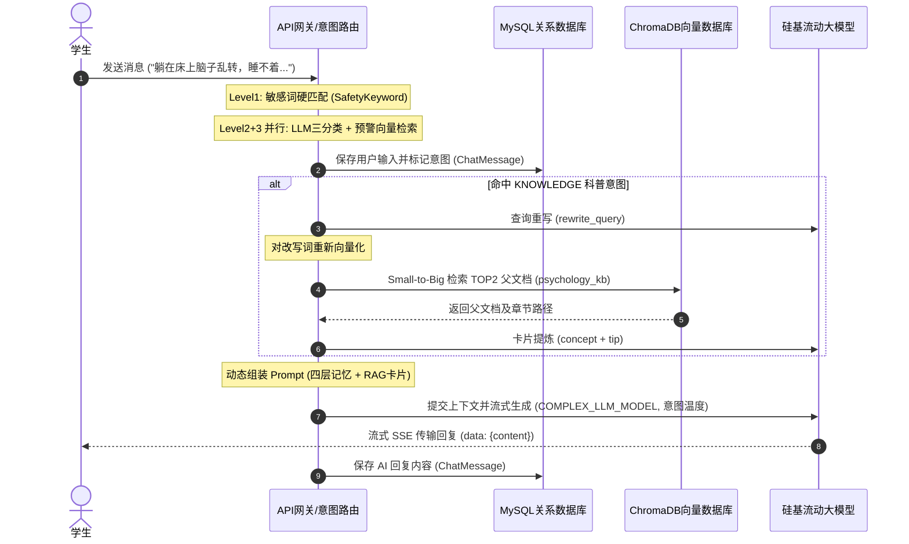

# MindEcho 系统数据模型与向量索引规约说明书

本项目采用 **双轨存储设计**，利用**关系型数据库（MySQL）**存储结构化业务实体和用户长期画像，利用**向量数据库（ChromaDB）**管理高维度语义特征和实现低延迟的语义召回，以此搭建“感性右脑 + 理性左脑”的双驱动心理健康管理平台。

---

## 一、 MySQL 关系型数据库结构规约

MySQL 主要管理系统的核心业务数据、结构化画像及聊天流水。核心物理表如下。

### 1. 用户账号表 (`users`)

*   **用途**：仅存储账号凭证与角色，实现与心理画像（`user_profiles`）的 1:1 隐私隔离。
*   **结构定义**：

| 字段名称 | 数据类型 | 约束条件 | 默认值 | 描述说明 |
| :--- | :--- | :--- | :--- | :--- |
| `id` | `INT` | Primary Key, Auto Increment | - | 用户唯一自增 ID |
| `username` | `VARCHAR(80)` | Unique, Not Null, Index | - | 登录账号/学号唯一标识 |
| `password_hash` | `VARCHAR(255)` | Not Null | - | Bcrypt 加盐哈希密码 |
| `role` | `VARCHAR(20)` | Not Null | `student` | 角色（`student` 学生 / `admin` 管理员） |
| `is_active` | `BOOLEAN` | Not Null | `True` | 激活状态 |
| `created_at` | `DATETIME` | Not Null | `CURRENT_TIMESTAMP` | 账号创建时间 |

### 2. 用户心理画像表 (`user_profiles`)

*   **用途**：存储敏感的心理特征长期记忆（唯一长期记忆源），与 `users` 1:1 关联。
*   **结构定义**：

| 字段名称 | 数据类型 | 约束条件 | 默认值 | 描述说明 |
| :--- | :--- | :--- | :--- | :--- |
| `id` | `INT` | Primary Key, Auto Increment | - | 画像唯一自增 ID |
| `user_id` | `INT` | Foreign Key (`users.id`), Unique, Not Null | - | 关联用户（1:1） |
| `nickname` | `VARCHAR(80)` | Nullable | Null | 显示昵称 |
| `core_stressors` | `JSON` | Nullable | `[]` | 核心压力源（JSON 数组） |
| `effective_coping_methods` | `JSON` | Nullable | `[]` | 历史验证有效的心理调节方法 |
| `entity_relation_map` | `JSON` | Nullable | `{}` | 重要人际关系映射 |
| `updated_at` | `DATETIME` | - | `CURRENT_TIMESTAMP` | 画像更新时间 |

> 注：`semantic_history_recall` 字段已随"语义向量召回链路"整体移除（见技术细节 02）。

### 3. 聊天会话主表 (`chat_sessions`)

*   **用途**：管理学生的聊天会话。**每个用户注册时固定创建两个会话**（`直接聊天` 落库 / `无痕树洞` 不落库）。
*   **结构定义**：

| 字段名称 | 数据类型 | 约束条件 | 默认值 | 描述说明 |
| :--- | :--- | :--- | :--- | :--- |
| `id` | `VARCHAR(36)` | Primary Key | UUID | 会话 UUID 字符串 |
| `user_id` | `INT` | Foreign Key (`users.id`), Nullable | Null | 关联用户（匿名树洞会话此字段为空） |
| `title` | `VARCHAR(255)` | Not Null | `"新对话"` | 固定会话名（`直接聊天` / `无痕树洞`） |
| `created_at` | `DATETIME` | Not Null | `CURRENT_TIMESTAMP` | 会话建立时间 |
| `summary` | `TEXT` | Nullable | Null | 预留字段（中期摘要已改内存存储，不再写入） |
| `is_anonymous` | `BOOLEAN` | Not Null | `False` | 是否为匿名无痕树洞（阅后即焚标志） |

### 4. 聊天消息明细表 (`chat_messages`)

*   **用途**：记录会话中发生的逐条对话记录（仅常规会话落库），并保留系统的意图识别标签。
*   **结构定义**：

| 字段名称 | 数据类型 | 约束条件 | 默认值 | 描述说明 |
| :--- | :--- | :--- | :--- | :--- |
| `id` | `INT` | Primary Key, Auto Increment | - | 消息唯一自增 ID |
| `session_id` | `VARCHAR(36)` | Foreign Key (`chat_sessions.id`), Not Null | - | 关联的会话 ID |
| `sender` | `VARCHAR(10)` | Not Null | - | 发送人类型（`"user"`: 学生，`"ai"`: AI） |
| `content` | `TEXT` | Not Null | - | 对话消息文本正文 |
| `intent` | `VARCHAR(50)` | Nullable | Null | 系统识别的意图类型（`CRISIS`, `KNOWLEDGE`, `EMOTION`） |
| `created_at` | `DATETIME` | Not Null | `CURRENT_TIMESTAMP` | 消息发送时间 |

### 5. 知识文档导入任务表 (`knowledge_imports`)

*   **用途**：记录知识文档上传/入库任务状态（异步 worker 处理），关联 ChromaDB `psychology_kb` 集合。
*   **结构定义**：

| 字段名称 | 数据类型 | 约束条件 | 默认值 | 描述说明 |
| :--- | :--- | :--- | :--- | :--- |
| `id` | `INT` | Primary Key, Auto Increment | - | 导入任务唯一自增 ID |
| `file_name` | `VARCHAR(255)` | Not Null, Index | - | 原始文件名 |
| `file_hash` | `VARCHAR(64)` | Unique, Not Null | - | 文件 SHA-256 哈希（去重） |
| `minio_bucket` / `minio_object_name` | `VARCHAR` | Not Null | - | MinIO 存储位置 |
| `file_size` | `INT` | Not Null | - | 文件字节数 |
| `status` | `VARCHAR(20)` | Not Null | `pending` | `pending / processing / success / failed` |
| `chunk_count` | `INT` | - | `0` | 生成的 chunk 总数 |
| `processed_chunks` | `INT` | - | `0` | 已向量化完成的 chunk 数（异步进度） |
| `error_message` | `TEXT` | Nullable | Null | 失败原因 |
| `created_at` | `DATETIME` | Not Null | `CURRENT_TIMESTAMP` | 创建时间 |

> 注：早期规划中的 `knowledge_cards` 表未落地；科普卡片数据以"文档导入 + 结构化切片"方式存入 ChromaDB。

---

## 二、 ChromaDB 向量数据库集合规约

向量数据库存储文本特征向量（Embedding），当前模型参数为 1024 维（对应 `BAAI/bge-large-zh-v1.5`）。ChromaDB 当前包含 **两个** 核心向量集合。

### 1. 心理学科普知识库集合 (`psychology_kb`)

*   **核心用途**：存放用于 RAG（检索增强生成）的专业心理知识切片。
*   **物理 ID 规范**：`{import_id}_chunk_{idx}`（导入任务 ID + chunk 序号）。
*   **文本块 (Documents)**：上下文增强文本 `【标题路径】\n{chunk 正文}`。
*   **元数据 (Metadata) 字典结构**：
    ```json
    {
      "import_id": 42,
      "file_name": "CBT综述.pdf",
      "chunk_index": 5,
      "h1": "认知行为疗法",
      "h2": "治疗方法",
      "h3": "认知重构技术",
      "section_id": "sec_2",
      "parent_content": "## 治疗方法\n### 认知重构技术\n...(完整父文档小节)...",
      "converter": "pymupdf4llm"
    }
    ```
*   **检索方式**：Small-to-Big——命中子 chunk 后展开为父文档小节（H2 层级），供 LLM 注入。

### 2. 安全预警样本集合 (`safety_warnings_kb`)

*   **核心用途**：三级安全路由的 Level 3 兜底——将用户输入与高危/违规样本向量比对，相似度 > 0.85 时熔断为 CRISIS。
*   **物理 ID 规范**：`db_sample_{id}`（对应 MySQL `safety_warning_samples` 表）。
*   **元数据 (Metadata) 字典结构**：
    ```json
    {
      "type": "high_risk | violation",
      "text": "预警样本原始文本",
      "db_id": 1
    }
    ```

> 注：早期规划中的 `intent_seeds_kb`（FAQ 向量路由）与 `semantic_history_kb`（会话语义归档）**均已移除**——意图分类改由 LLM 三分类完成，长期记忆收敛为用户画像（见技术细节 02）。

---

## 三、 数据流动与同步示意图


