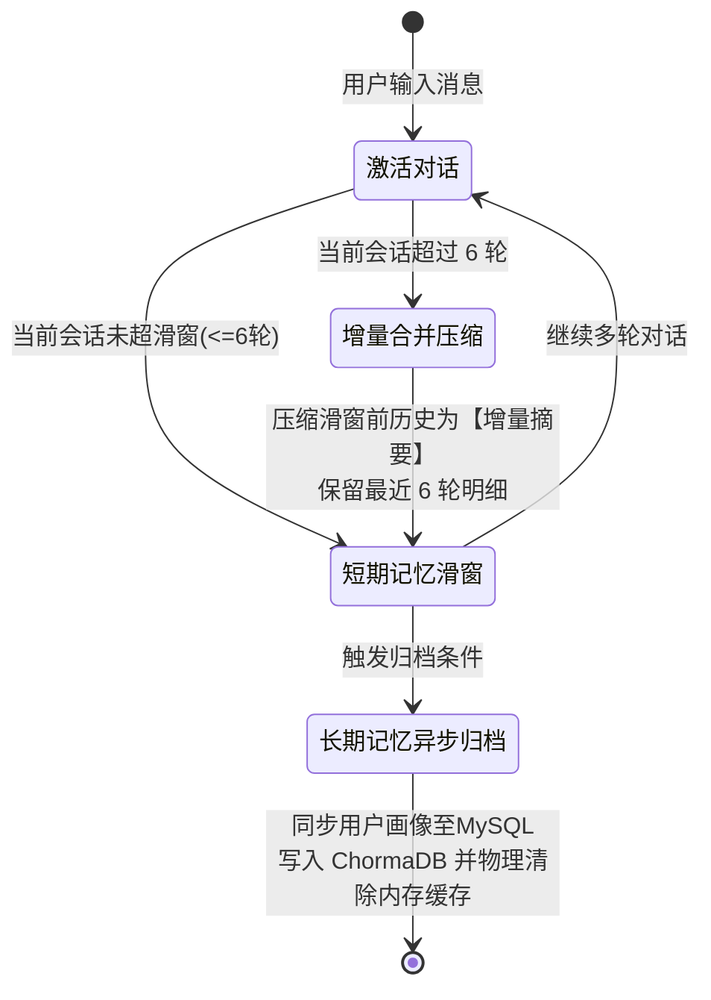

# MindEcho 大模型服务与选型技术规约书

在校园 AI 心理委员系统中，我们设计了 **四类模型分工协同** 的架构方案，以在满足“高共情、双驱动”的业务要求的同时，在大模型即时生成时延与深度推理分析之间取得完美平衡。

本文件对系统所需的大模型、对应的核心功能、参数设置及硅基流动平台模型选型推荐进行系统归纳。

---

## 1. 向量嵌入模型 (Embedding Model)

### 📌 核心功能与应用场景
1.  **RAG 科普知识库检索**：
    *   将管理员录入的“科普卡片”文本（概念 + 自助技巧）进行向量特征计算，同步存入 ChromaDB。
    *   在学生咨询心理学概念时，将查询词（Query）实时转化为向量，在库中进行高维空间距离检索。
2.  **高频 FAQ 意图匹配（第二级意图路由）**：
    *   将预先标定的高频意图种子句（如“心理咨询室实体地址”）进行向量化。
    *   与学生输入进行实时向量余弦相似度计算，对于超高匹配度（如 $> 0.85$）直接命中路由，无需大模型参与，时延 $< 50\text{ms}$。
3.  **会话语义事件归档检索（长期记忆）**：
    *   将历史历次会话的压缩摘要进行向量化，在新会话开始时利用语义相似度匹配，检索出最关联的 1-2 条往期聊天背景线索。

### 🤖 模型选型推荐 (硅基流动平台)
*   **推荐型号**：`BAAI/bge-large-zh-v1.5`
*   **备选型号**：`BAAI/bge-m3`
*   **选型理由**：对中文心理学专有名词和口语化表达表征精准，维度达 1024 维，检索粒度细腻，推理速度极快（平均 $< 30\text{ms}$）。

---

## 2. 轻量级意图分类模型 (Simple/Lightweight LLM)

### 📌 核心功能与应用场景
1.  **语义意图分类路由（第三级意图路由）**：
    *   对于通过前两级规则过滤后的学生输入，调用轻量模型进行极速语义识别。
    *   要求输出符合严格 Schema 的 JSON 字符串，分类结果为以下之一：`CRISIS`（危机）、`KNOWLEDGE`（科普）、`EMOTION`（共情对话）、`CHITCHAT`（闲聊）。
2.  **用户查询词重写 (Query Rewriting)**：
    *   将学生输入的带有强情绪发泄的口语化长文本，在进行 RAG 检索前，快速提炼重写为 1-2 个心理学科普关键词（如“失眠焦虑调理”），降低搜索噪声。

### ⚙️ 参数调优规范
*   **温度（Temperature）**：设置 `Temperature = 0.0`，消除生成的随机性，确保意图分类确定性。
*   **最大 Token 限制（Max Tokens）**：限制 `Max Tokens = 30 ~ 50`。极短的生成内容配合轻量参数，可实现首字时延 $< 200\text{ms}$ 的极速响应。

### 🤖 模型选型推荐 (硅基流动平台)
*   **推荐型号**：`Qwen/Qwen2.5-7B-Instruct`
*   **备选型号**：`GLM-4-9B-Chat`
*   **选型理由**：指令遵循能力强，可稳定输出指定格式 of JSON 数据，时延低、吞吐高。

---

## 3. 高共情对话大模型 (Complex/High-Capability LLM)

### 📌 核心功能与应用场景
1.  **多轮心理共情陪伴（`EMOTION` / `CHITCHAT` 路由）**：
    *   扮演温柔、包容、非批判性的心理委员角色。
    *   运用 CBT（认知行为疗法）等专业心理咨询话术，采取“同理心共情 ➔ 情绪抱持 ➔ 启发引导觉察”三步法舒缓学生情绪。
    *   必须支持 **Server-Sent Events (SSE) 流式返回**，保障首字渲染（TTFT）时间在 2 秒以内。
2.  **知识科普温和解答（`KNOWLEDGE` 路由）**：
    *   将 RAG 检索出的专业心理卡片（概念释义 + 自助技巧）作为背景知识注入，由该模型进行人性化、无说教感的深度润色解答。

### ⚙️ 参数调优规范
*   **温度（Temperature）**：设置 `Temperature = 0.7`，增加词汇多样性和生动度，使语言听起来更温暖、更拟真。
*   **最大 Token 限制（Max Tokens）**：设置 `Max Tokens = 1024`，保障完整话语的顺畅生成。

### 🤖 模型选型推荐 (硅基流动平台)
*   **推荐型号**：`deepseek-ai/DeepSeek-V3`
*   **备选型号**：`Qwen/Qwen2.5-72B-Instruct`
*   **选型理由**：作为大体量模型，能精准把控人类细微的情感变化，抹除大模型惯有的“直男说教腔”，生成流式回复速度极快。

---

## 4. 后台推理与总结大模型 (Reasoning/Summary LLM)

### 📌 核心功能与应用场景
1.  **异步会话提炼与归档**：
    *   当会话结束时，由后台异步任务调用该模型，深度分析整段对话内容，提炼出 200 字以内的“会话简要总结”并进行向量归档。
2.  **用户结构化画像抽取**：
    *   深度梳理用户对话，识别最新的核心压力源、重要社会关系网变动、以及被证实对其有安抚效果的自助方法，并输出结构化 JSON，增量更新到 MySQL 的 `users` 表画像字段中。

### ⚙️ 参数调优规范
*   **温度（Temperature）**：设置 `Temperature = 0.2 ~ 0.3`，追求逻辑推理与提炼准确性，避免对事实过度想象。
*   **最大 Token 限制（Max Tokens）**：设置 `Max Tokens = 1024`。由于是在后台异步执行，延迟不敏感，允许其长时间推理。

### 🤖 模型选型推荐 (硅基流动平台)
*   **推荐型号**：`deepseek-ai/DeepSeek-R1`
*   **性价比型号**：`deepseek-ai/DeepSeek-R1-Distill-Qwen-32B`
*   **选型理由**：需要进行复杂的长文本归档和结构化实体识别，`DeepSeek-R1` 的深度思考能够极佳地胜任这类重逻辑、重推理的背景审计工作。

---

## 5. 会话记忆周期与上下文压缩策略规范

系统通过双轨记忆（短期会话记忆滑窗 + 长期记忆画像归档）机制来实现持续共情，具体交互与总结触发频次规范如下：

### 🧠 1. 短期记忆滑窗与上下文增量压缩（实时触发：每 6 轮一次）
为了控制上下文 Token 消耗，防止对话历史膨胀降低大模型注意力或导致首字响应变慢：
- **滑窗限制**：系统在内存/缓存中以**最近 6 轮对话**（即 12 条问答消息明细）作为滚动滑窗。
- **触发频次**：当会话每增加 6 轮（即对话超出 6 轮滑窗阈值时），系统将滑窗**之前**的历史对话段交由 **【推理/总结大模型】** 进行**增量合并压缩**。
- **压缩输出**：生成一段不超过 **200 字** 的 **“历史会话增量摘要”** 并作为系统设定（System Prompt）中的 `session_summary` 占位符持续传递。滑窗内的最近 6 轮对话则继续以原始明细格式呈现。

### 💾 2. 长期记忆总结与用户画像归档周期（触发条件）
长期记忆并不需要在多轮对话中频繁处理（以降低计算开销和 API 调用费用），而是通过以下三个生命周期时间节点进行触发归档：

#### A. 主动超时归档（核心触发：静默 30 分钟）
- **判定标准**：当系统检测到用户连续 **30 分钟** 无任何新消息交互时，判定当次会话已结束。
- **归档动作**：后台异步任务（如任务队列）调用 **【推理/总结大模型】** 总结整段对话，生成向量写入 ChromaDB 语义集合 `semantic_history_kb`；同时提取核心实体关系，更新 MySQL 中 `users` 对应的画像（核心压力源、历史有效技巧等）。

#### B. 重要事件驱动归档（辅助触发：单轮意图识别命中重大变更）
- **判定标准**：在多轮对话中，若第三级意图路由检测到用户提到了重大的生活节点变更。
- **事件样例**：*“我答辩通过了”*、*“今天跟导师摊牌了”*、*“我们分手了”*。
- **归档动作**：当轮对话生成完毕后，立即在后台异步触发一次画像同步任务，更新 MySQL 中的 `core_stressors`（压力源）或 `entity_relation_map`（重要人际关系表）。

#### C. 用户主动行为归档（强制同步触发）
- **判定标准**：当学生点击界面上的 **“开启新话题”** 或 **“清空聊天历史”** 按钮时。
- **归档动作**：为了避免数据物理清除后造成信息丢失，系统在物理删除短期 Redis/数据库缓存之前，**强行同步触发一次长期记忆归档流程**，沉淀用户画像后再执行物理删除，确保“无痕树洞”下的用户心理画像也能在下一次会话中被静默继承。

---

## 6. 业务链路与大模型分工总览表

| 触发业务 | 执行时序 | 模型类型 | 推荐选型 | 运行温度 | 输出格式 | 核心职责 |
| :--- | :--- | :--- | :--- | :--- | :--- | :--- |
| **敏感词/意图路由** | 同步实时 | 快速模型 | `Qwen2.5-7B-Instruct` | `0.0` | `JSON Object` | 判定分类意图并选择合适链路 |
| **查询词提炼重写** | 同步实时 | 快速模型 | `Qwen2.5-7B-Instruct` | `0.0` | 纯文本词汇 | 提炼核心词服务于 RAG |
| **向量特征生成** | 同步实时 | 向量模型 | `bge-large-zh-v1.5` | - | 1024维特征 | 向量化 Query 或知识库 Chunk |
| **日常倾诉共情** | 同步实时 | 高共情模型 | `DeepSeek-V3` | `0.7` | `SSE Stream` | Gentle 语气流式共情陪伴 |
| **科普润色解答** | 同步实时 | 高共情模型 | `DeepSeek-V3` | `0.5` | `SSE Stream` | 融合知识库提供温和科学指引 |
| **会话滑窗压缩** | 同步实时 | 推理总结模型 | `DeepSeek-R1` | `0.2` | 200字内摘要 | 每 6 轮压缩滑窗外的历史消息 |
| **会话画像归档** | 异步后台 | 推理总结模型 | `DeepSeek-R1` | `0.2` | 结构化 JSON | 30分钟超时等场景总结归档长期画像 |
